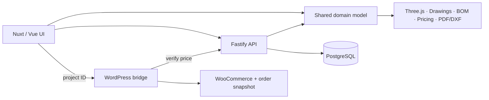

# VARYFORM

**Parametric 3D Product Configurator** — Configure. Visualize. Manufacture.


VARYFORM is a parametric 3D product configurator for made-to-order
manufacturing and e-commerce. A customer sets dimensions and options to the
millimetre and sees the product rebuilt instantly as procedural Three.js
geometry. The same configuration produces technical drawings, a bill of
materials, a live price, a PDF project sheet and a millimetre-accurate DXF
file, and can be ordered through WooCommerce.

The reference product is a modular shelving system: dimensions, sections,
shelves, board thickness, material, back panel and legs.

**What makes it technically interesting:** one framework-independent
TypeScript domain model generates the 3D geometry, drawings, BOM, pricing and
both exports. The same code runs in the browser and in the API, so every view
is consistent by construction and the price cannot be tampered with from the
client.

**Stack:** Nuxt 4 · Vue 3 · TypeScript · Three.js · Fastify · PostgreSQL ·
Drizzle · WordPress · WooCommerce

**Role:** solo project — architecture, frontend, API and the WooCommerce
plugin designed and built by me.

## Features

- **Parametric 3D configurator** — procedural geometry rebuilt from validated parameters; orbit and zoom on desktop, touch rotation on mobile.
- **Real-time pricing** — material-area estimate plus hardware allowance, recalculated on every change.
- **CAD-like technical drawings** — front and side orthographic SVG elevations with dimension lines, zoom and fit-to-view.
- **Bill of materials** — grouped parts with quantities, cut sizes and materials.
- **PDF project sheet** — cover with 3D render and specification, A3 vector elevations, BOM page.
- **DXF export** — front and side elevations in millimetres (`$INSUNITS = mm`) on `OUTLINE / PANELS / SHELVES / DIMENSIONS / TEXT` layers.
- **Saved & shared projects** — public read-only links (`/project/VRF-…`) and a private edit token for the creator.
- **WooCommerce integration** — Add to cart from the configurator for guests and logged-in customers, server-verified price, classic checkout re-verification, order snapshots in admin and My Account.

## Engineering Highlights

- **Shared domain model.** `packages/domain` is pure TypeScript with no framework dependencies; the browser and the Fastify API import the same validation, parts, BOM, price, drawing geometry and export data functions.
- **Procedural geometry.** `calculateParts()` places every panel, shelf, divider, back panel and leg in millimetres; Three.js converts to metres at one boundary and the drawings project the same parts into 2D.
- **Single source of truth.** One `Configuration` object in Pinia drives every view; switching 3D/Drawing never mutates state and preserves the 3D camera.
- **Server-authoritative commerce pricing.** WooCommerce receives only a project ID, fetches price/BOM from the API, ignores tampered browser fields and re-verifies every project before classic checkout (fail-closed, one clear message per configuration).
- **Immutable order snapshots.** Configuration, dimensions, BOM and price are copied to the order line; later edits to a shared project never change historical orders.
- **Millimetre-accurate DXF.** Real-size geometry independent of screen scaling, validated with an independent DXF parser (ezdxf audit: 0 errors) for small, medium and maximum configurations.
- **Performance-aware loading.** Three.js, PDF and DXF code load on demand; one WebGL context is reused across mode switches and temporary snapshot contexts are released.
- **Tested end to end.** 76 automated tests plus real-browser E2E of the full WooCommerce flow.

| Bundle (route `/`) | Size (min / gzip) |
| --- | --- |
| Initial JS before optimization | 842 kB / 238 kB |
| Initial JS after optimization | **241 kB / 89 kB** |
| Three.js viewer | 506 kB / 127 kB — lazy-loaded |
| DXF export | 90 kB / 22 kB — lazy-loaded |
| PDF export (jsPDF) | lazy-loaded on demand |

## Architecture



- **Nuxt → Fastify → PostgreSQL:** save, share and edit projects; the API recalculates price/BOM/dimensions on every read.
- **Nuxt → WordPress bridge → WooCommerce:** the browser sends only a project ID; the plugin verifies it server-to-server before cart and checkout.

Engineering details: [docs/ARCHITECTURE.md](./docs/ARCHITECTURE.md).

## Tech Stack

| Layer | Technology |
| --- | --- |
| Frontend | Nuxt 4, Vue 3, TypeScript (strict), Pinia, Three.js, SVG |
| Exports | jsPDF (PDF), `@tarikjabiri/dxf` (DXF) |
| API | Fastify 5, Drizzle ORM, PostgreSQL 17 |
| Commerce | WordPress, WooCommerce, PHP 8 plugin |
| Tooling | npm workspaces, ESLint, vue-tsc, node:test, Docker Compose |

## Screenshots

Final screenshots will be stored in [`docs/images/`](./docs/images/). Planned images, all using the same demo project — *Living Room Shelving, 1400 × 1900 × 400 mm, Walnut, 25 mm boards, 3 sections, 4 shelves, back panel, metal legs (€3,323)*:

| File | Shows |
| --- | --- |
| `01-configurator.webp` | Main 3D configurator (desktop) |
| `02-technical-drawing.webp` | Front elevation with dimensions |
| `03-bom-pricing.webp` | Parts list and estimated total |
| `04-project-pdf.webp` | PDF project sheet (cover + elevation) |
| `05-woocommerce-cart.webp` | WooCommerce cart with the verified configuration |
| `06-order-snapshot.webp` | WooCommerce admin order snapshot with BOM |

## Local Development

Requirements: Node 22.22+ or 24.15+, Docker, PHP 8 CLI (plugin tests only).

```sh
cp .env.example .env                    # local defaults, no secrets
npm install
docker compose up -d db                 # PostgreSQL on 127.0.0.1:5432
npm run db                              # apply Drizzle migrations
npm run dev                             # Nuxt http://localhost:3000 + Fastify http://localhost:3001
```

`npm run dev:api` starts only the API. Without `NUXT_PUBLIC_WORDPRESS_URL` the **Add to cart** button is disabled.

<details>
<summary>Optional: local WordPress + WooCommerce</summary>

```sh
docker compose -f docker-compose.wordpress.yml up -d   # http://localhost:8080 (WP_ENVIRONMENT_TYPE=local)
```

Complete the WordPress installer, install WooCommerce, activate the mounted **VARYFORM WooCommerce Bridge** plugin, create the published simple product **VARYFORM Configured Product**, set the store currency to EUR and site visibility to **Live**, and use classic Cart/Checkout pages. In WooCommerce → Settings → VARYFORM set API URL `http://host.docker.internal:3001`, Configurator URL `http://localhost:3000`, the product ID and a timeout. See [wordpress/varyform-woocommerce/README.md](./wordpress/varyform-woocommerce/README.md).

WooCommerce emails may not be delivered in the local Docker environment unless an SMTP server or mail catcher is configured. All Compose credentials are local-only demo values.

</details>

## Tests

**76 tests passing.**

| Suite | Command | Tests |
| --- | --- | --- |
| Domain — geometry, BOM, pricing, drawings, DXF/PDF data | `npm run test --workspace @varyform/domain` | 22 |
| API — routes, validation, edit tokens, legacy IDs, errors, limits, CORS | `npm run test --workspace @varyform/api` | 15 |
| WordPress/WooCommerce — bridge, nonce, cart, checkout, order views | `npm run test:wordpress` | 39 |

```sh
npm run typecheck && npm run lint && npm run test && npm run test:wordpress && npm run build
```

The WooCommerce flow is also verified end to end in a real Chrome browser against WordPress 7.1.2 / WooCommerce 11.1.2: guest and logged-in Add to cart from the configurator UI, authoritative pricing, price-tampering rejection, duplicate/different projects, classic checkout, admin and My Account snapshots, and Fastify-outage handling.

## Security

See [SECURITY.md](./SECURITY.md) — server-side pricing, hashed edit tokens, sanitized API errors, CORS and rate limits, the WordPress nonce design, and the current `npm audit` assessment.

## Known Limitations

- **WooCommerce Checkout Blocks** are not supported; checkout re-verification targets classic checkout (a Store API adapter would be needed).
- **No user accounts** in the configurator — editing uses a browser-held edit token without rotation/revocation.
- **Same-site hosting** is required for Nuxt and WordPress so the cart session cookie works cross-origin.
- **Local email delivery** requires an SMTP server or mail catcher.
- **Dependency advisories** remain in build/dev tooling (`node-forge` via Nuxt CLI, `braces`, `esbuild`) with no non-breaking fix; none is reachable from the running application.
- **Exports are previews**, not manufacturing release documents (2D elevations with line/text dimensions; preliminary pricing).

## Deployment

Recommended setup — Vercel (Nuxt), Render/Railway/Fly.io (Fastify), Neon/Railway (PostgreSQL) and a WordPress host — with environment variables, build/start/migration commands, CORS and plugin settings: [docs/DEPLOYMENT.md](./docs/DEPLOYMENT.md).

## License

Copyright © 2026. All rights reserved. No open-source license has been granted yet; the source is published for portfolio review.

Repository: `varyform-3d-configurator`.

